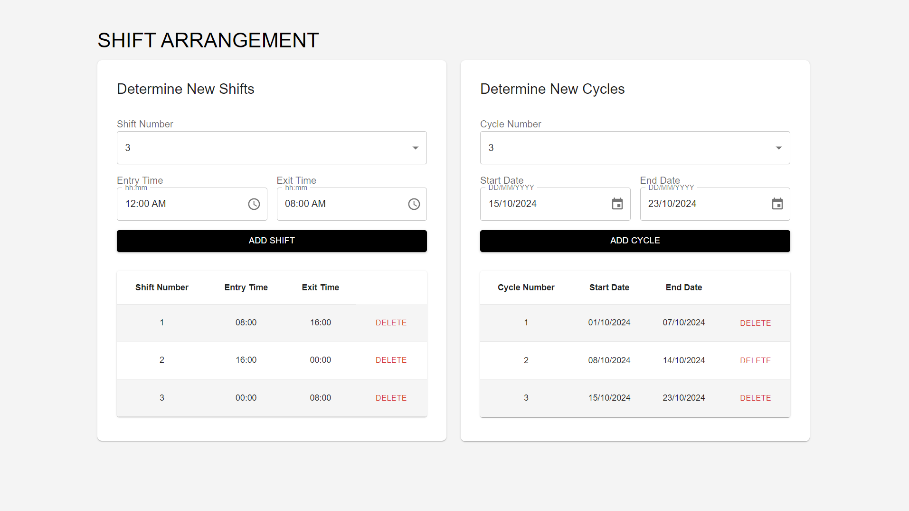

# Shift and Cycle Management

Bu proje, **React** ve **Material UI** kullanılarak geliştirilmiş bir vardiya ve döngü yönetim uygulamasıdır. Uygulama, Material UI bileşenleri ile duyarlı ve kullanıcı dostu bir arayüz sunmaktadır.

## Özellikler

### 1. Vardiya Yönetimi
- **Yeni Vardiya Oluşturma:** "Vardiya Numarası", "Giriş Saati" ve "Çıkış Saati" alanları ile yeni vardiyalar eklenebilir.
- **Vardiya Listesi Görüntüleme:** Vardiya bilgilerini tablo halinde görüntüleyebilir, ayrıca ekleme ve silme işlemleri yapabilirsiniz.

### 2. Döngü Yönetimi
- **Yeni Döngü Oluşturma:** "Döngü Numarası", "Başlangıç Tarihi" ve "Bitiş Tarihi" alanları ile yeni döngüler oluşturulabilir.
- **Döngü Listesi Görüntüleme:** Döngü bilgilerini tablo halinde görüntüleyebilir, ekleme ve silme işlemleri yapabilirsiniz.

### Genel Özellikler
- **Duyarlı Tasarım:** Uygulama, mobil, tablet ve masaüstü cihazlarda sorunsuz çalışacak şekilde duyarlı olarak tasarlanmıştır.
- **Material UI Kullanımı:** Grid, Card, Button, Typography gibi Material UI bileşenleri kullanılarak kullanıcı arayüzü oluşturulmuştur.
- **Tablo Kullanımı:** Vardiya ve döngü listeleri, Material UI’ın tablo bileşenleri ile şık ve işlevsel bir biçimde sunulmaktadır.
- **Form Yönetimi ve Doğrulama:** Form doğrulama işlemleri, **React Hook Form** ve **Zod** kullanılarak yapılmıştır. Tüm alanlar zorunludur ve doğrulama hataları kullanıcıya gösterilir.

## Kullanılan Teknolojiler
- **React**: Ana uygulama yapısı ve bileşen yönetimi için.
- **Material UI**: Kullanıcı arayüzü bileşenleri ve duyarlı tasarım için.
- **React Hook Form & Zod**: Form doğrulama ve şema doğrulaması için.



## Kurulum

1. Bu projeyi klonlayın:
   ```bash
   git clone https://github.com/SemanurOrhan/shift-cycle-manager-app

2. Proje dizinine gidin:
   ```bash
   cd shift-cycle-management

3. Gerekli bağımlılıkları yükleyin:
    ```bash
   npm install

5. Uygulamayı çalıştırın:
    ```bash
   npm start

